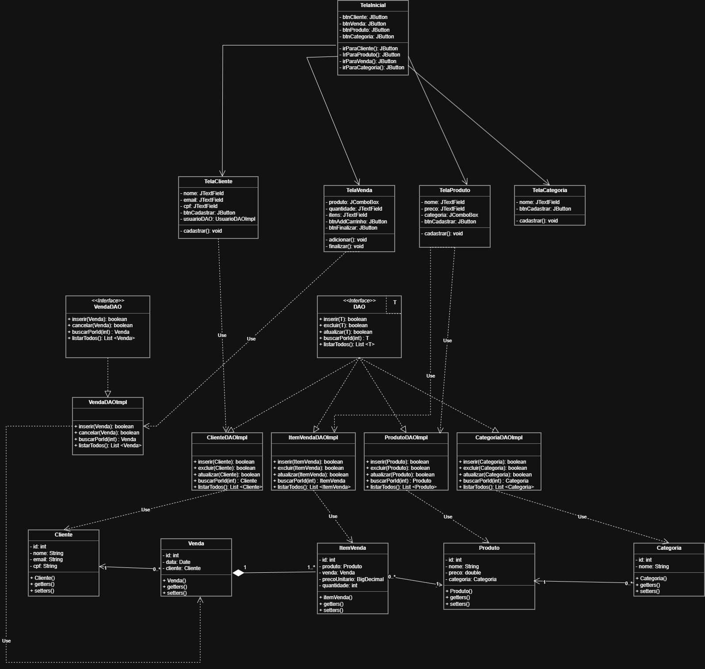

# CRUD-Floricultura
Projeto de DS com objetivo de criar um sistema para um comércio

# Contribuintes
<table>
  <tr>
    <td align="center">
      <a href="https://github.com/JAOJAO000">
        <br>
        <sub><b>João Pedro</b></sub>
      </a>
    </td>
    <td align="center">
      <a href="https://github.com/ReisAsdf11">
        <br>
        <sub><b>Pedro Reis</b></sub>
      </a>
    </td>
    <td align="center">
      <a href="https://github.com/vitor0930">
        <br>
        <sub><b>Vitor Lopes</b></sub>
      </a>
    </td>
    <td align="center">
      <a href="https://github.com/yoyozito">
        <br>
        <sub><b>Yohann Montim</b></sub>
      </a>
    </td>
  </tr>
</table>

# Proposta
Desenvolver um sistema com Java e MySQL de uma floricultura para facilitar o registro e o cadastro de produtos, vendas, e clientes

# Escopo do sistema
## Funcionalidades presentes
- Cadastrar clientes
- Registrar vendas
- Registrar produtos
- Controlar estoque
- Cancelar vendas

## Funcionalidades fora do escopo
- Não haverá emissão de nota fiscal eletrônica
- Não haverá conexão com sistemas de pagamento
- Não haverá relatórios financeiros avançados

## Usuários
- Operador de caixa

## Tecnologias
- Java
- Swing
- MySQL

## Restrições
- Sistema de uso local

# Requisitos do Sistema
## Requisitos Funcionais (RF)
 
| Código | Descrição |
|--------|-----------|
| RF01 | Cadastrar clientes |
| RF02 | Registrar vendas |
| RF03 | Registrar produtos |
| RF04 | Controlar estoque |
| RF05 | Cancelar venda |
 
## Regras de Negócio (RN)
 
| Código | Descrição |
|--------|-----------|
| RN01 | O e-mail do cliente deve ser único e válido |
| RN02 | Deve haver apenas um registro por cliente |
| RN03 | O preço do produto não pode ser 0.00 |
| RN04 | Um produto não pode ser registrado com dados nulos/obrigatórios ausentes |
| RN05 | Toda venda deve registrar automaticamente a data/hora (timestamp) no momento da criação |
| RN06 | Vendas não podem ser excluídas ou alteradas após criadas — apenas canceladas (o cancelamento deve ser um status, não uma exclusão) |
| RN07 | Uma venda cancelada deve reverter o estoque dos produtos envolvidos |
| RN08 | O estoque deve ser reduzido automaticamente ao registrar uma venda |
 
## Requisitos Não Funcionais (RNF)
 
| Código | Descrição |
|--------|-----------|
| RNF01 | O sistema deve ser executado em ambiente desktop (swing) com conexão MySQL local |
| RNF02 | A interface deve seguir um padrão visual consistente entre todas as telas |

# Script do banco
``` SQL 
CREATE DATABASE floricultura;

USE floricultura;

CREATE TABLE clientes(
    id INT NOT NULL AUTO_INCREMENT PRIMARY KEY,
    nome VARCHAR(100) NOT NULL,
    email VARCHAR(100) NOT NULL,
    cpf CHAR(11) NOT NULL
);
ALTER TABLE
    clientes ADD UNIQUE clientes_email_unique(email);
ALTER TABLE
    clientes ADD UNIQUE clientes_cpf_unique(cpf);
CREATE TABLE produtos(
    id INT NOT NULL AUTO_INCREMENT PRIMARY KEY,
    nome VARCHAR(100) NOT NULL,
    preco DECIMAL(10, 2) NOT NULL,
    categoria_id INT NOT NULL
);
CREATE TABLE categorias(
    id INT NOT NULL AUTO_INCREMENT PRIMARY KEY,
    nome VARCHAR(100) NOT NULL
);
CREATE TABLE vendas(
    id INT NOT NULL AUTO_INCREMENT PRIMARY KEY,
    data_venda DATETIME NOT NULL,
    cliente_id INT NOT NULL,
    cancelada BOOLEAN NOT NULL DEFAULT FALSE
);
CREATE TABLE itens_vendas(
    id INT UNSIGNED NOT NULL AUTO_INCREMENT PRIMARY KEY,
    venda_id INT NOT NULL,
    produto_id INT NOT NULL,
    valor_unitario DECIMAL(8, 2) NOT NULL,
    quantidade INT NOT NULL
);
ALTER TABLE
    itens_vendas ADD CONSTRAINT itens_vendas_venda_id_foreign FOREIGN KEY(venda_id) REFERENCES vendas(id);
ALTER TABLE
    vendas ADD CONSTRAINT vendas_cliente_id_foreign FOREIGN KEY(cliente_id) REFERENCES clientes(id);
ALTER TABLE
    produtos ADD CONSTRAINT produtos_categoria_id_foreign FOREIGN KEY(categoria_id) REFERENCES categorias(id);
ALTER TABLE
    itens_vendas ADD CONSTRAINT itens_vendas_produto_id_foreign FOREIGN KEY(produto_id) REFERENCES produtos(id);
```

# Diagrama de classes

